# ADORE REDCap Update

This page accompanies [Adore_clin_data](https://redcap.uky.edu/redcap/redcap_v14.8.2/index.php?pid=22540), a REDCap-based project holding clinical data and counts of biospecimens associated with the ADORE biobank.

This repo was created by Ken Campbell, k.s.campbell@uky.edu.

The REDCap project was created from raw data originally stored in [ADORE Clinical Data](https://redcap.uky.edu/redcap/redcap_v14.8.2/index.php?pid=17918). Details on how this was done are shown further below.

## How to update the sample counts

### Download current ADORE data

+ Open the [Adore_clin_data](https://redcap.uky.edu/redcap/redcap_v14.8.2/index.php?pid=22540) project

+ Click Export Data for the "Data for Python pull" report 
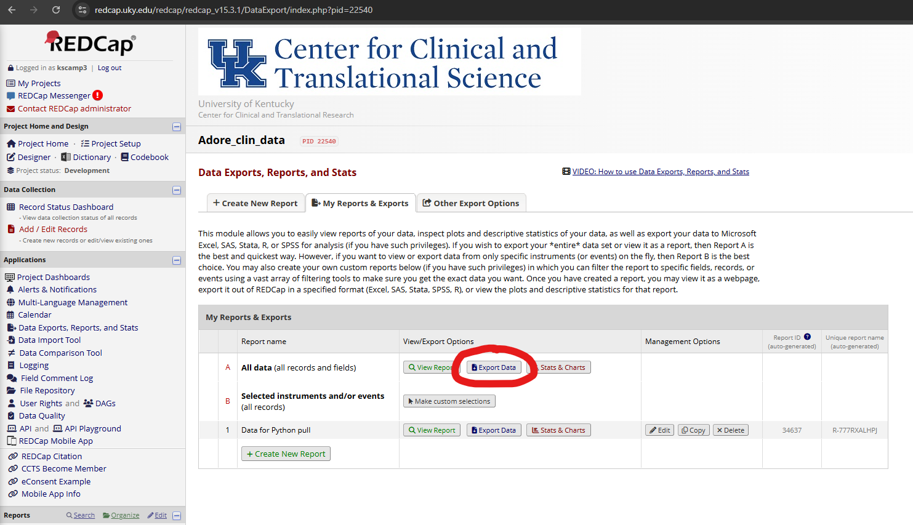

+ Select CSV / Excel Raw data and Export Data 
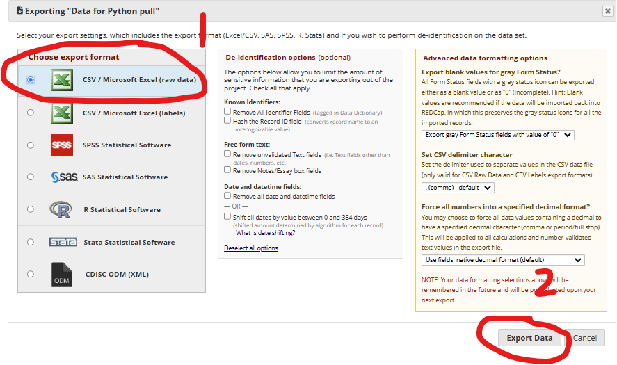

+ Click on the icon to download the file 
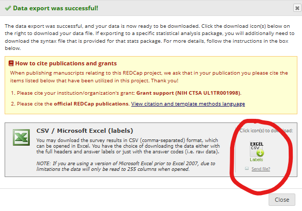

+ Find that file and save it somewhere appropriate for Protected Health Information, for example, `"d:/ken/adore/data/current/redcap_report.csv"`

### Download specimen inventory from OnCore

+ Log in to [UK's OncCore system](https://uky-oncore-prod.forteresearchapps.com/forte-platform-web/login)

+ Menu->Specimens->Custom report 
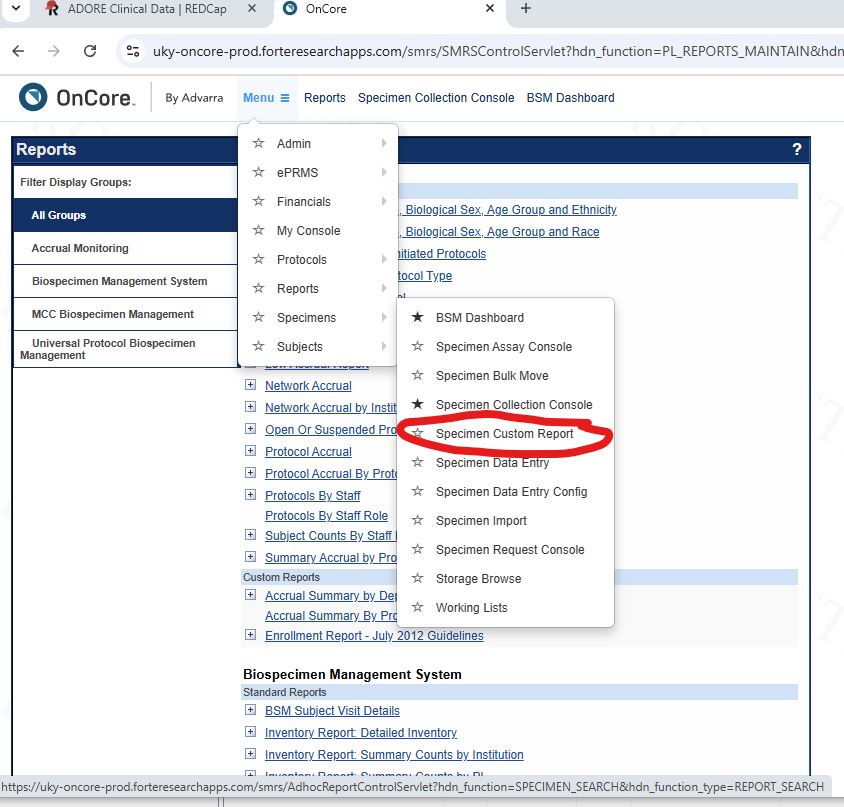

+ Select the "All ADORE specimens" report 
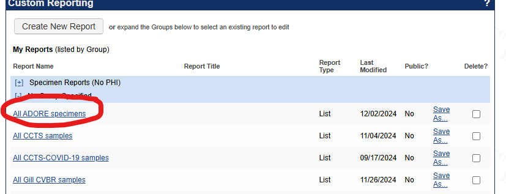

+ Keep clicking Next until you get to the report results.

+ Go to the very bottom, and click "Export CSV" 

+ Find that file and save it somewhere appropriate for Protected Health Information, for example, `"d:/ken/adore/data/current/oncore_report.csv"`

### Run Python code to deduce sample counts for each time-point

If you need help running Python code in a defined environment, see [howtos_Python](https://campbell-muscle-lab.github.io/howtos_Python/pages/anaconda/anaconda.html)

+ Open a command prompt

+ Activate the `REDCap_ADORE` environment defined in `<repo>/enviroment` 
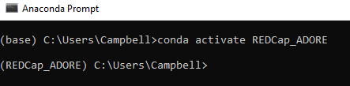

+ Change to the `Python_code` folder for this repository. 
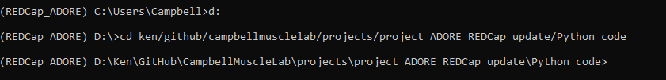

+ Type `python update_sample_inventory.py your_redcap_file your_oncore_file your_output_folder` and press `Enter`
  + Note - this will generate files that contain protected health information in `your_output_folder`
  + For example 
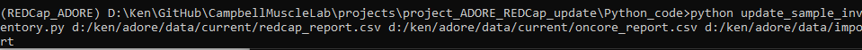

+ The output folder will now contain 4 files
  + `redcap_import.csv` - the file you will upload to REDCap in the next step to update the database
  + `oncore_data.csv` - an intermediate file generated by the code that might be useful for trouble-shooting
  + `sample_counts.csv` - the number of samples of each type for each participant in a tabular format
  + `not_found.csv` - samples from patients that are not found in REDCap
  +  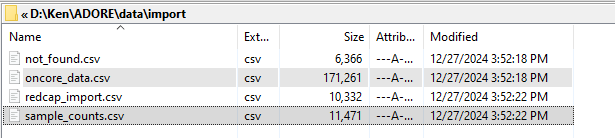

### Import sample inventory into REDCap

+ Open the [Adore_clin_data](https://redcap.uky.edu/redcap/redcap_v14.8.2/index.php?pid=22540) project

+ Go to the Data import tool 
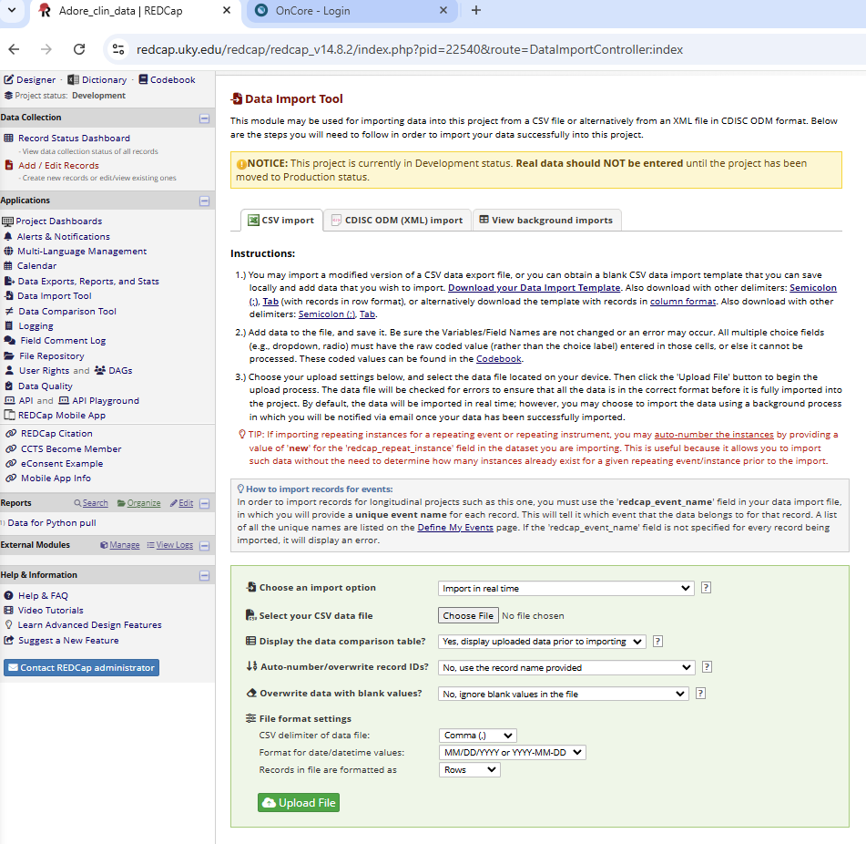

+ Click on `Choose File` and select the `oncore_data.csv` file that was generated above 
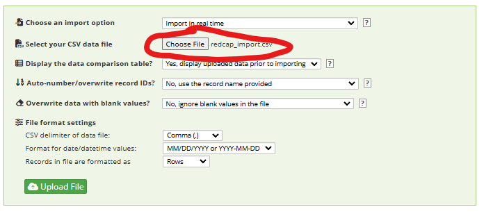

+ Click on `Upload` 
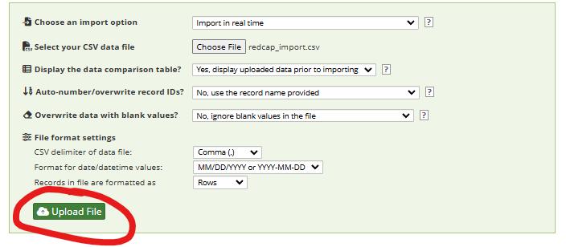

+ Check for a successful upload 
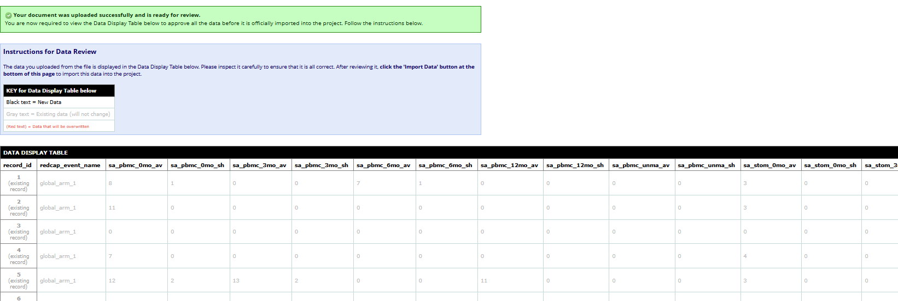

+ Scroll to the bottom and click `Import Data` 
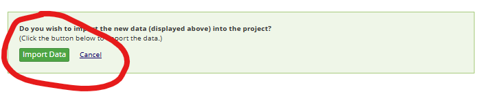

+ Check for the success page 
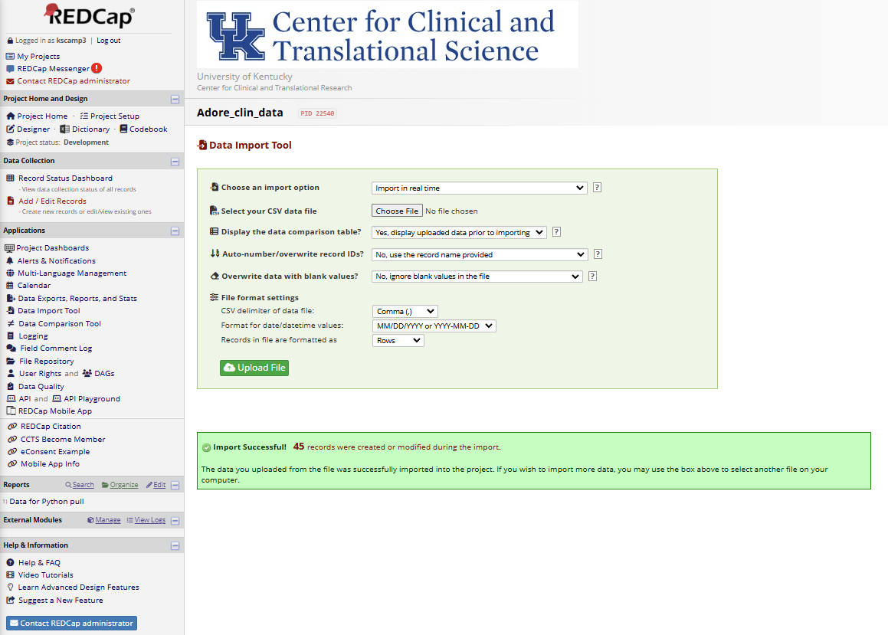

